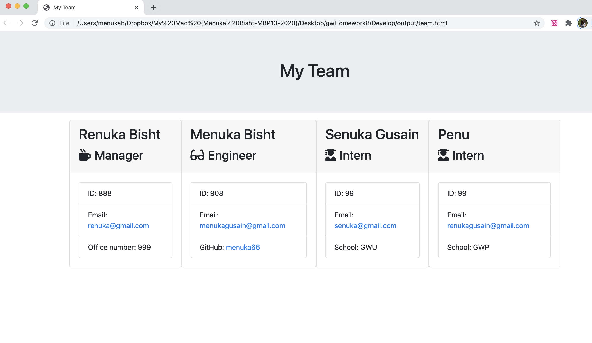

# Unit 10 OOP Homework: Template Engine - Employee Summary

Discription :

This is Node CLI application that takes in information about employees and generates an HTML webpage that displays summaries for each person. You can also run NPM test to see if your test cases passed. 

How to Ust the App

1. Clone the rpo from https://github.com/Menuka786/gwHomework8
2. Install the modules with : npm install
3. Open app.js in Terminal, then input :node app.js
5.  Answer all the prompted questions.
4. This will generate HTML file. Open team.html in browser to see your generated team.
5. To run your test, open in test in Terminal, input npm run test on your terminal.
6. You can see test results will be shown on Terminal.

Video link for this app :

Screen shot of html page

